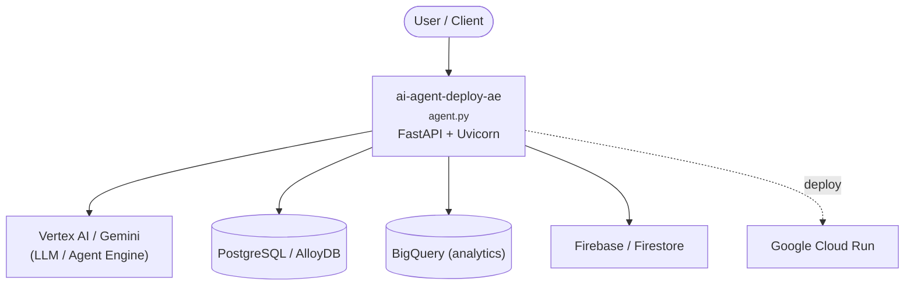

# Context Map — `ai-agent-deploy-ae`

> Auto-generated architecture & deployment context map. Summarizes the core application, container/cloud footprint, and database connections. Regenerate after significant structural changes.

**Repo:** `avnit/ai-agent-deploy-ae` · **Original** · Public · Primary language: Jupyter Notebook · Default branch: `main` · Files: 44

**Description:** A collection of production-ready Generative AI Agent templates built for Google Cloud. It accelerates development by providing a holistic, production-ready solution, addressing common challenges (Deployment & Operations, Evaluation, Customization, Observability) in building and deploying GenAI agents.

## 1. Core application

content-repo-template

- **Frameworks / runtime:** FastAPI + Uvicorn, Jupyter notebooks
- **Entry points:** `labs/AgentEngineDeploy/agent.py`
- **Listens on port(s):** 5432, 53, 143, 1108

## 2. Containers & cloud applications

**Detected cloud platforms / services:** Vertex AI / Gemini (GCP), Google Cloud Run, Firebase / Firestore, BigQuery, Terraform

## 3. Database connections

**Datastores in use:** PostgreSQL / AlloyDB, BigQuery (analytics)

**Referenced in:**
- `colabs/AgentEngine_PrivateNetwork_Connectivity (2).ipynb`
- `colabs/MA_with_CR_and_CD_old.ipynb`
- `colabs/servicenow_agentEngine2.ipynb`

**Environment / config files:** `labs/AgentEngineDeploy/.env`, `labs/AgentEngineDeploy/modelarmor/.env`

> ⚠️ Non-template env files are committed: `labs/AgentEngineDeploy/.env`, `labs/AgentEngineDeploy/modelarmor/.env`. Verify no live secrets are tracked.

## 4. Architecture diagram

## 5. Security posture

- No open Dependabot alerts or static-scan findings recorded.

---
_Generated by repo context-mapping pass on 2026-08-13._